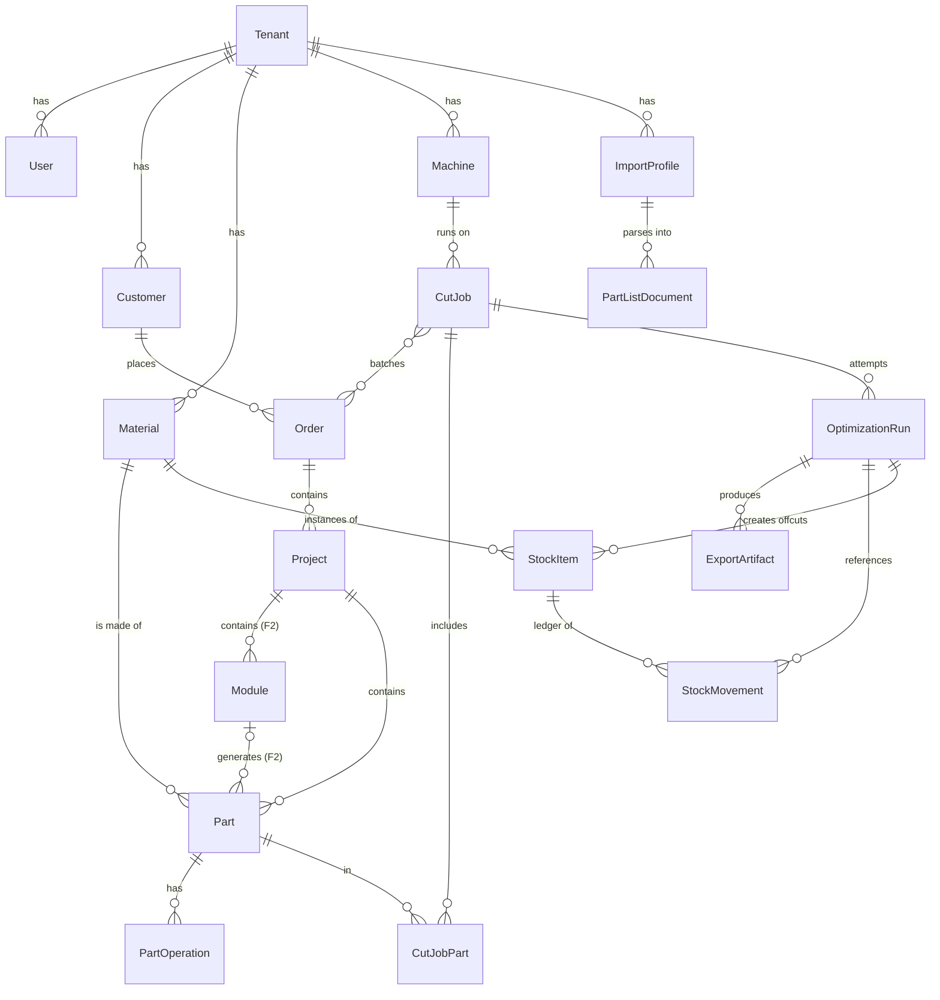

# Veri Modeli

Faz 0 şeması; Faz 2 için bugünden açılan alanlar **(F2)** ile işaretli. Tüm uzunluklar `bigint` µm (ADR-0002). Tüm tenant tabloları `tenant_id` + RLS (ADR-0007).

## Konvansiyonlar

- Birincil anahtar: `id UUID` (v7 tercih). Sıralı, indeks dostu, tenant'lar arası çakışmasız.
- Her tenant tablosunda: `tenant_id UUID NOT NULL`, `created_at timestamptz`, `updated_at timestamptz` (UTC). Bileşik indeksler `tenant_id` ile başlar.
- Soft delete yok; pasifleştirme `is_active`. Append-only tablolar (`stock_movements`) hiç güncellenmez.
- Para: `*_minor bigint` + `currency char(3)`. Oran: `*_bp int` (basis point).
- Enum'lar PostgreSQL enum değil `text` + check constraint (migration'sız değer ekleme).

## Varlık ilişki diyagramı

## Varlıklar

### `Tenant`
| Alan | Tip | Not |
|---|---|---|
| `id` | UUID | |
| `name`, `slug` | text | |
| `country_code` | char(2) | `CountryPort` seçimi |
| `locale` | text | `tr-TR` |
| `base_currency` | char(3) | Faz 0'da tüm maliyet bu birimde |
| `settings` | JSONB | `min_offcut_length_um`, `min_offcut_width_um`, `offcut_preference` |
| `plan`, `is_active` | | abonelik |

### `User`
`id, tenant_id, email, password_hash, role (OWNER | OPERATOR | VIEWER), locale (nullable), is_active`. Auth ayrıntısı `AuthPort`.

### `Customer`
`id, tenant_id, name, phone, email, address (JSONB), tax_id (nullable), notes, is_active`.

### `Order`
| Alan | Not |
|---|---|
| `customer_id` | FK |
| `number` | tenant içinde tekil, sıralı |
| `status` | `DRAFT \| CONFIRMED \| IN_PRODUCTION \| DONE \| CANCELLED` |
| `due_date` | date |
| `notes` | |

### `Project`
`id, tenant_id, order_id, name, notes`. Bir siparişin iş birimi ("mutfak alt dolaplar"). Maliyet projeksiyonu bu seviyede.

### `Module` **(F2)**
`id, tenant_id, project_id, template_ref, params (JSONB), generated_at`. Faz 0'da tablo oluşturulur, boş kalır. Parametrik dolap örneği; parçaları üretir.

### `Part`
Bkz. ADR-0006 tam liste. Özet:

| Alan | Tip | F2 |
|---|---|---|
| `project_id` | FK | |
| `module_id` | nullable FK | F2 |
| `label` | text | etikette görünür |
| `material_id` | FK Material(SHEET/LINEAR) | |
| `finished_length_um`, `finished_width_um`, `thickness_um` | bigint | |
| `qty` | int | |
| `edges` | JSONB `{L1, L2, W1, W2}` → nullable material_id | |
| `rotation` | `NONE \| ROT_180 \| ROT_90 \| ANY` | |
| `grain` | `NONE \| ALONG_LENGTH \| ALONG_WIDTH` | |
| `outline` | nullable JSONB poligon | F2 |
| `face_reference` | `FACE1 \| FACE2` (hangi yüz görünen) | |
| `source` | `IMPORT \| MANUAL \| CAD` | |
| `finished_is_derived` | bool | ithalat RAW |
| `import_batch_id` | nullable FK | izlenebilirlik |
| `notes` | | |

**`raw_*` kolonu yoktur** (ADR-0009).

### `PartOperation`
`id, tenant_id, part_id, seq, type, face, geometry (JSONB), machining_ref (nullable), edge_band_material_id (nullable, type=EDGE_BAND ise)`. Faz 0'da yalnızca `EDGE_BAND` satırları (edges alanının normalize hali) — ⚠️ `edges` JSONB ile `EDGE_BAND` operasyonlarının ikisi birden tutulacaksa tek kaynak `edges`, operasyon satırları türetilir; ilk implementasyonda karar netleştirilecek.

### `Material`
Bkz. `material-model.md`.

### `Machine`
Bkz. ADR-0017.

### `StockItem`
| Alan | Not |
|---|---|
| `material_id` | FK |
| `is_offcut` | bool |
| `length_um`, `width_um` | plaka/artık ölçüsü (SHEET/LINEAR); diğer tiplerde null |
| `origin_run_id` | nullable FK OptimizationRun; `is_offcut` ise NOT NULL (check) |
| `origin_sheet_index` | hangi plakadan |
| `location` | text, nullable (raf kodu) |
| `barcode` | text, tenant içinde tekil |
| `notes` | |

Mevcut adet/durum bu tabloda **yoktur**; `stock_movements` projeksiyonudur.

### `StockMovement` (append-only)
| Alan | Not |
|---|---|
| `stock_item_id` | FK |
| `material_id` | denormalize (raporlama) |
| `movement_type` | ADR-0003 enumu |
| `qty` | bigint; birim malzeme tipine göre (adet / µm / m² ×10⁶ ⚠️ / adet) |
| `reference_type`, `reference_id` | `ORDER \| CUT_JOB \| OPTIMIZATION_RUN \| MANUAL` |
| `unit_cost_minor`, `currency` | o anki maliyet (WEIGHTED_AVG için) |
| `reason` | text; `ADJUST` için zorunlu |
| `created_by`, `created_at` | |

Projeksiyon view'ları: `v_stock_levels(material_id, available, reserved)`, `v_offcut_status(stock_item_id, status)`.

### `ImportProfile`
Bkz. `docs/integration/import-profiles.md`.

### `ImportBatch`
`id, tenant_id, profile_id, file_ref (S3), dimension_basis, status (PREVIEW | COMMITTED | DISCARDED), row_count, warnings (JSONB), committed_at`. Önizleme aşamasındaki satırlar `PartListDocument` olarak S3'te/JSONB'de tutulur; `COMMITTED` olunca `Part` satırları yazılır.

### `CutJob`
| Alan | Not |
|---|---|
| `name` | |
| `machine_id` | FK, zorunlu |
| `status` | `DRAFT \| OPTIMIZING \| REVIEW \| APPROVED \| CUT \| CANCELLED` |
| `approved_run_id` | nullable FK |
| `params` | JSONB: mod, artık tercihi, zaman sınırı, izin verilen malzeme/plaka listesi |

`cut_job_orders(cut_job_id, order_id)` ve `cut_job_parts(cut_job_id, part_id, qty)` bağlantı tabloları. Batch = birden çok sipariş.

### `OptimizationRun`
Bkz. ADR-0005. Salt okunur belge.

### `ExportArtifact`
`id, tenant_id, run_id, kind (PDF_PLAN | LABELS | DXF_R12 | CSV), file_ref, delivery_status (PENDING | DOWNLOADED | DELIVERED | FAILED), created_at`. Yerel ajan (ADR-0015) `delivery_status`'u günceller.

### `DxfLayerProfile`
Bkz. `docs/integration/dxf-conventions.md`.

## Maliyet projeksiyonu (Faz 0, basit)

`ProjectCost` tablo değil, sorgu: onaylı koşunun tükettiği plaka/artık (`CONSUME` hareketleri × `unit_cost`), bant metrajı (bitmiş kenar boyu + allowance × `price_per_m`), donanım (elle girilen adet × `unit_price`). Tek para birimi (`tenant.base_currency`).

## Faz 2 için açık bırakılanlar (özet)

| Alan | Nerede | Faz 0 değeri |
|---|---|---|
| `Module` tablosu | — | boş |
| `Part.module_id`, `Part.outline` | Part | null |
| `PartOperation` (DRILL/GROOVE/NOTCH) | — | üretilmez |
| `Material.attrs.machining_ref` (HARDWARE) | Material | null |
| `Material.catalog_ref` | Material | serbest metin |
| `Machine.post_processor` | Machine | `DXF_R12` |
| `ExportArtifact.delivery_status = DELIVERED` | — | kullanılmaz |
